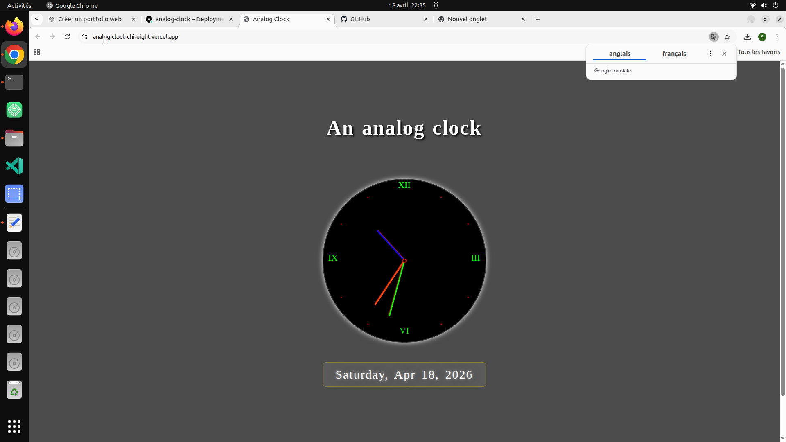

# 🕰️ Analog Clock

A clean and minimal analog clock built with HTML, CSS, and JavaScript.

---

## 🔗 Live Demo
https://analog-clock.vercel.app

## 📂 GitHub Repository
https://github.com/saidhadjadj/analog-clock

---

## 🌍 Overview
This project is a real-time analog clock that visually represents hours, minutes, and seconds using smooth CSS transformations and JavaScript updates.

---

## ✨ Features
- 🕰️ Real-time analog clock
- 🎯 Smooth rotating hands
- 📱 Fully responsive design
- 🎨 Minimal clean UI
- ⚡ Lightweight JavaScript logic

---

## 📸 Preview

---

## 🛠️ Tech Stack
- HTML5
- CSS3 (transforms, animations)
- JavaScript (ES6)

---

## 🎯 Purpose
This project helps practice DOM manipulation, time-based updates, and CSS rotation transformations.

---

## 👤 Author
Said Hadjadj
